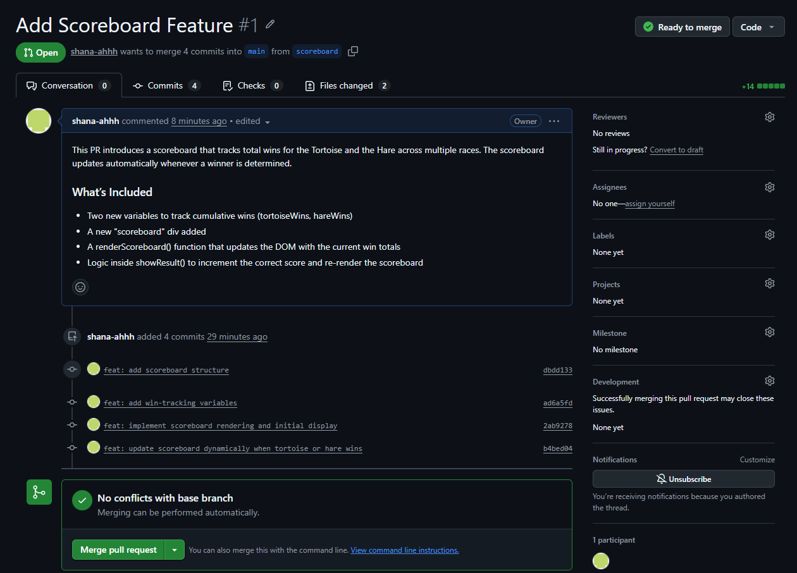

# 🐢🐰 Tortoise & Hare Race — Enhanced Version

## 1. What feature did you implement?

I implemented Option A – Add a Scoreboard, which tracks cumulative wins for both racers across multiple rounds.

## 2. What was the most difficult bug or issue?

The most challenging issue was ensuring the scoreboard updated only when the race actually ended, not during every race step. Because the race logic runs inside a setInterval, it was easy to update the scoreboard too early or multiple times.

The fix was to:

<ul>
    <li>Increment wins only inside showResult()</li>    
    <li>Ensure showResult() is called after clearing the interval</li>  
    <li>Re-render the scoreboard immediately after updating the win counters</li>   
</ul>

## 3. My 3 Best Commit Messages

<ul>
    <li>feat: add win-tracking variables</li>
    <li>feat: implement scoreboard rendering and initial</li>
    <li>feat: update scoreboard dynamically when tortoise or hare wins</li>
</ul>

## 4. Screenshot of Pull Request

